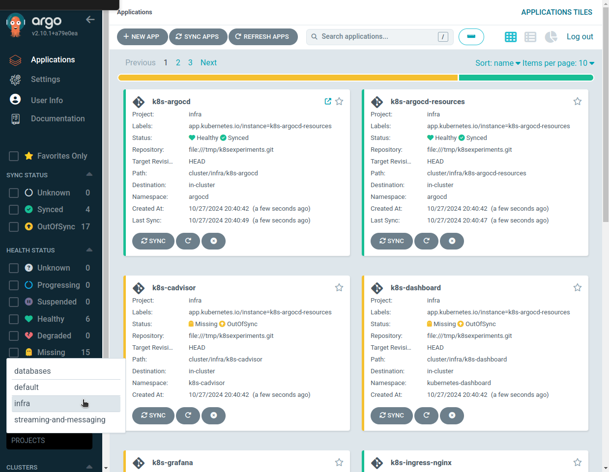
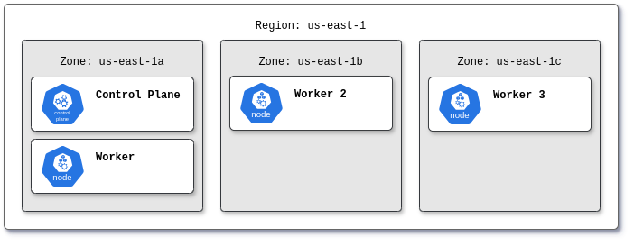

# Kubernetes Experimentation Cluster

A local kind cluster for rapid Kubernetes experimentation and testing.

An early-release, local kind cluster, designed for iterative development and testing.



## Quickstart

Clone this repository and follow the steps to create a consistent development environment. We've carefully selected specific versions of tools to ensure reproducibility.

This repository has been tested on an x86-64 Linux system running Ubuntu 24.04.

### Install requirements

```sh
# Install Docker 27.3.1
curl -fsSL https://get.docker.com -o install-docker.sh
sudo sh install-docker.sh --version 27.3.1

# Install Kind 0.24.0
curl -fsSL https://kind.sigs.k8s.io/dl/v0.24.0/kind-linux-amd64 -o kind
sudo install -o root -g root -m 0755 kind /usr/local/bin/kind

# Install Kubectl 1.31.0
curl -fsSL https://dl.k8s.io/release/v1.31.0/bin/linux/amd64/kubectl -o kubectl
sudo install -o root -g root -m 0755 kubectl /usr/local/bin/kubectl
```

### [Optional] Download fresh TLS certificates

[Traefik.me](https://traefik.me/) certificates have a limited lifespan. If your certificate nears expiration, follow these instructions to download a fresh one.

```sh
# Download new certificates
curl -fsSL https://traefik.me/cert.pem -o cluster/infra/tls/cert.pem
curl -fsSL https://traefik.me/chain.pem -o cluster/infra/tls/chain.pem
curl -fsSL https://traefik.me/fullchain.pem -o cluster/infra/tls/fullchain.pem
curl -fsSL https://traefik.me/privkey.pem -o cluster/infra/tls/privkey.pem

# Copy certificates for services that requires it
cp cluster/infra/tls/fullchain.pem cluster/infra/k8s-ingress-controller/fullchain.pem
cp cluster/infra/tls/privkey.pem cluster/infra/k8s-ingress-controller/privkey.pem
```

### Create Cluster

For streamlined setup, a default password has been provided. By default, all services listen on `localhost`. Customize the [kind.yaml](kind.yaml) file to modify port bindings.

```sh
# Create Cluster
kind create cluster --config kind.yaml --image kindest/node:v1.31.0@sha256:53df588e04085fd41ae12de0c3fe4c72f7013bba32a20e7325357a1ac94ba865 --name k8sexperiments

# Deploy ArgoCD
kubectl apply -k cluster/infra/k8s-argocd

# Deploy Nginx Ingress Controller
kubectl apply -k cluster/infra/k8s-ingress-controller

# Wait Nginx Ingress to become ready
echo "Waiting ingress to become ready..."
kubectl wait --namespace ingress-nginx --for=condition=ready pod --selector=app.kubernetes.io/component=controller --timeout=120s

# Add the cluster stack to ArgoCD
kubectl apply -k cluster/infra/k8s-argocd-resources
```

Done :tada::tada::tada:

## Delete Cluster

```sh
# Delete Cluster
kind delete cluster --name k8sexperiments
```

## Topology



|Node|Labels|Port Mapping ( Host -> NodePort )|
|----|------|----------------------------------|
|Control Plane|ingress-ready: true, topology.kubernetes.io/region: us-east-1, topology.kubernetes.io/zone: us-east-1a|80->80, 443->443|
|Worker|application: true, redis: true, topology.kubernetes.io/region: us-east-1, topology.kubernetes.io/zone: us-east-1a|6379->36379, 16379->46379|
|Worker 2|application: true, ssh: true, kafka: true, topology.kubernetes.io/region: us-east-1, topology.kubernetes.io/zone: us-east-1b|22222->30022, 9092->39092, 9093->39093, 9094->39094|
|Worker 3|application: true, mongodb: true, topology.kubernetes.io/region: us-east-1, topology.kubernetes.io/zone: us-east-1c|27017->37017, 27018->37018, 27019->37019|

## Cluster Infra

Post-cluster creation, [ArgoCD](ttps://argocd-127-0-0-1.traefik.me) will manage all application installations and updates.

|Name|Ingress URL|Username|Password|Notes|
|----|-----------|:------:|:------:|-----|
|ArgoCD - 2.10.1|https://argocd-127-0-0-1.traefik.me|`root`|`Ch@ngeMe`|
|cAdvisor - 0.50.0||||
|Kubernetes Dashboard - 2.7.0|https://dashboard-127-0-0-1.traefik.me|||Get Token: `kubectl get secret admin -n kubernetes-dashboard -o jsonpath={".data.token"} \| base64 -d`|
|Grafana - 11.2.0|https://grafana-127-0-0-1.traefik.me|`admin`|`Ch@ngeMe`|
|Nginx Ingress Controller - 1.11.2||||
|Prometheus - 2.54.1|https://prometheus-127-0-0-1.traefik.me|||
|Prometheus Operator - 0.77.0||||
|Metrics Server - 0.7.2||||
|Kube State Metrics - 2.13.0||||
|OpenSSH - [Jumpbox](https://en.wikipedia.org/wiki/Jump_server)||`admin`|`Ch@ngeMe`| Access: `ssh admin@127.0.0.1 -p 22222`|

## Cluster Stack

A pre-configured stack is ready for immediate use. For specific details, such as connection strings, click on the desired stack.

### Databases

|Name|Admin User|Admin Password|App User|App Password|
|----|:--------:|:------------:|:------:|:----------:|
|[Mongo 6.0.10 - Replicaset](cluster/databases/mongo/6.0.10/)|`root`|`Ch@ngeMe`| `application`|`Ch@ngeMe`|
|[Mongo 7.0.14 - Replicaset](cluster/databases/mongo/7.0.14/)|`root`|`Ch@ngeMe`|`application`|`Ch@ngeMe`|
|[Mongo 8.0.3 - Replicaset](cluster/databases/mongo/8.0.3/)|`root`|`Ch@ngeMe`|`application`|`Ch@ngeMe`|
|[Redis 7.4.1 - Standalone](cluster/databases/redis/7.4.1-standalone/)|`default`|`Ch@ngeMe`|-|-|
|[Redis 7.4.1 - Replication](cluster/databases/redis/7.4.1-replication/)|`default`|`Ch@ngeMe`|-|-|
|[Redis 7.4.1 - OSS Cluster](cluster/databases/redis/7.4.1-cluster/)|`default`|`Ch@ngeMe`|-|-|

### Streaming and Messaging

|Name|Admin User|Admin Password|App User|App Password|
|----|----------|--------------|--------|------------|
|[Kafka - Kraft 3 Nodes](cluster/messaging/kafka/3.8.0/)|-|-|-|-|